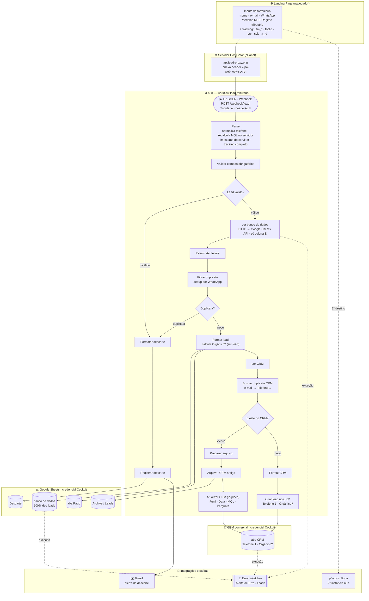

# Captura Tributário

> Landing page de captação e qualificação de leads para o curso de tributação para marketplaces — tráfego pago.


🌐 **[Ver página ao vivo](https://tributariomarketplace.metodop4.com.br/)** · 📁 **[Repositório GitHub](https://github.com/taysouzaa/captura-tributario)**

## Visão do Projeto

O **Captura Tributário** foi construído para transformar tráfego pago em leads qualificados para o curso de tributação para marketplaces do Método P4, conectando aquisição, coleta de dados e automação em um fluxo único.

### O que o sistema resolve

- Evita perda de lead entre formulário e automação.
- Centraliza captação com validação de dados e qualificação por medalha e regime tributário.
- Preserva origem de tráfego (UTM) para análise de performance de campanhas.
- Classifica automaticamente o lead como MQL (qualificado) ou não qualificado.

## O Que Foi Desenvolvido

### 1. Captação e Tracking
- Captura de origem (`channel`, `source`, `medium`, `campaign`, `content`, `referrer`, `page_url`) via script de tracking first-touch.
- Persistência de parâmetros UTM no navegador para reaproveitamento no submit.

### 2. Formulário de Qualificação
- Captura de nome, e-mail, WhatsApp e confirmação.
- Pergunta de qualificação: **medalha no Mercado Livre** e **regime tributário atual**.
- Validação local de consistência de telefone (WhatsApp e confirmação).
- Interface responsiva para mobile e desktop.

### 3. Lógica de Qualificação (MQL)
- `MQL = "Sim"` quando: medalha ≠ sem_medalha **e** regime ≠ MEI.
- `MQL = "Não"` para leads fora do perfil ideal.
- Campo enviado no payload para o webhook n8n.

### 4. Integração com Automação
- Envio de payload para webhook n8n (`/webhook/lead-Tributario`).
- Deduplicação por telefone no n8n antes de gravar na planilha.
- Gravação simultânea na aba **pago** e na aba **banco de dados** do Google Sheets.

## Stack Técnica

- **Frontend:** HTML5, CSS3, JavaScript (vanilla)
- **Tipografia:** Sora (local via `@font-face`)
- **Tracking:** Google Tag Manager + Microsoft Clarity
- **Integração:** Webhook n8n via **proxy PHP** server-side (`api/lead-proxy.php`) — o segredo do webhook fica no servidor, fora do JS público
- **Deploy:** HostGator/cPanel

## Arquitetura (Resumo)

| Camada | Responsabilidade |
| --- | --- |
| `index.html` | LP principal |
| `assets/` | Imagens, vídeos e ícones |
| `fonts/` | Tipografia local (Sora) |
| `depoimentos/` | Screenshots de depoimentos |
| `docs/` | Workflow n8n e documentação de UTMs |
| `DOCUMENTACAO.md` | Documentação técnica completa |

## Funcionamento do Sistema

1. Usuário acessa a LP via anúncio pago.
2. Tracking first-touch inicializa e persiste UTMs.
3. Usuário preenche formulário de qualificação.
4. Aplicação calcula MQL e monta payload com dados + tracking.
5. Payload é enviado para o webhook n8n.
6. n8n deduplica por telefone consultando o banco de dados.
7. Lead é gravado nas abas **pago** e **banco de dados** do Google Sheets.



## Estrutura do Projeto

```text
.
├─ assets/
│  ├─ hero-bg.png
│  ├─ logo-p4-nav.png
│  ├─ logo-p4-footer.png
│  ├─ equipe-p4.jpg
│  ├─ equipe-p4-reuniao.jpg
│  ├─ poster-aula.webp
│  └─ video-aula.mp4
├─ depoimentos/
├─ fonts/
│  └─ static/
├─ docs/
│  ├─ n8n-workflow-tributario.json
│  └─ links-utms-facebook-google.md
├─ index.html
├─ DOCUMENTACAO.md
└─ LICENSE
```

## Automação de leads (estado atual — 2026-07)

O lead **não é mais enviado direto do navegador ao n8n**. A página chama o **proxy PHP**
`api/lead-proxy.php` (mesmo domínio, sem nenhum segredo); o proxy anexa o header de autenticação
`x-p4-webhook-secret` **no servidor** e repassa ao webhook n8n `POST /webhook/lead-Tributario`.

O workflow n8n **`lead-tributario`** executa o pipeline completo (funil pago → aba **Pago**):

- **Valida** os obrigatórios e **deduplica por WhatsApp** — sem descarte silencioso.
- Grava 100% dos leads em `banco de dados` e na aba de segmentação **Pago** (classificação por
  funil pareado).
- Alimenta o **CRM comercial**: dedup por e-mail → `Telefone 1`, arquiva o registro antigo em
  `Archived Leads` e atualiza in-place, ou cria um novo — preenchendo a coluna **`Orgânico?`**
  (`sim`/`não`) conforme a origem do lead.
- **Recalcula MQL no servidor** (nunca confia no cliente) e usa **timestamp do servidor**.
- Captura tracking completo: `utm_source/medium/campaign/content/term/id`, `fbclid`, `src`, `sck`,
  `a_id`, `channel`, `referrer`, `page_url`.
- Registra descartes (inválido/duplicata) na aba `Descarte` e **notifica por e-mail** (Gmail).
- Erros reais caem no **Error Workflow** `Alerta de Erro - Leads`.

📄 Documentação detalhada da automação: a **Sticky Note "Documentação da automação"** dentro do
workflow `lead-tributario` no n8n, e — quando presente — o `automation/README.md` do projeto.

## Licença

A licença **permanece inalterada** e segue os termos proprietários definidos em [LICENSE](./LICENSE).
