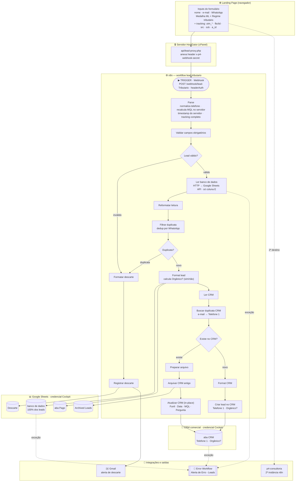

# Automação de leads — workflow n8n `lead-tributario`

Documentação da automação que processa os leads do formulário da landing page
([`../index.html`](../index.html)) até a gravação no Google Sheets e no CRM comercial.
Padronizada a partir do padrão de referência **Imersão**, preservando as regras de negócio
próprias do funil **pago** de Tributário.

- **Workflow:** `lead-tributario`
- **ID:** `rD0LOINTnTAGGvrm`
- **Instância n8n:** `n8n.srv1095468.hstgr.cloud`
- **Webhook:** `POST /webhook/lead-Tributario` (autenticado por header `x-p4-webhook-secret`)
- **Status:** ativo, produção
- **Export versionado:** [`workflow.json`](./workflow.json) — fonte de verdade auditável. Qualquer
  mudança futura deve ser re-exportada para este arquivo (o workflow é editado tanto via API
  quanto pelo editor visual; sempre reexporte após editar).

## Posição na arquitetura de funis pareados

Diferente da Imersão (um único workflow que segmenta Pago/Organico internamente por `fbclid`),
a família Tributário usa **dois** funis separados:

| Funil | Workflow | Landing page | Aba de destino | `Funil` |
|---|---|---|---|---|
| **Pago (este)** | `lead-tributario` | página de tráfego pago | **Pago** + banco de dados | `Tributario` |
| Orgânico | `LP-Tributario` | página orgânica | Organico + banco de dados | `tributario-organico` |

A classificação de origem é feita **no nível do funil** — por isso este workflow escreve sempre
na aba **Pago**, sem um IF `É pago?` interno. Isso é regra de negócio, não é bug.

## Objetivo

Capturar o lead ao enviar o formulário, validar/enriquecer no servidor (sem confiar em valores
que o navegador poderia forjar), evitar duplicatas, e alimentar tanto as planilhas de controle/
marketing quanto o CRM comercial — sem nunca perder um lead silenciosamente e sem perder o
histórico comercial de um lead que já existia.

## Fluxo completo

## Nó a nó

| Node | Tipo | O que faz |
|---|---|---|
| **Webhook lead-Tributario** | Webhook | Recebe o POST, valida `x-p4-webhook-secret` (credencial `P4 Webhook Secret - lead-tributario`). |
| **Parse lead-Tributario** | Code | Parse do body, normaliza telefone, recalcula MQL e timestamp no servidor, captura tracking completo (inclui `fbclid`, `utm_term`, `utm_id`, `src`, `sck`, `a_id`), monta `Pergunta Adicional` = `Medalha ML` + `Regime tributario`, `Funil='Tributario'`. |
| **Validar campos obrigatórios** | Code | Marca `_descartado` se nome/e-mail/WhatsApp inválidos — nunca descarta silenciosamente. |
| **Lead válido?** | IF | Vazio → fluxo normal; preenchido → notificação de descarte. |
| **Ler banco de dados** | HTTP Request | Lê só a coluna E (WhatsApp) via API do Google Sheets (credencial `Cockpit`), ~24× menos dado que ler a linha inteira. |
| **Reformatar leitura** | Code | Converte a resposta bruta da API em `[{json:{WhatsApp}}]`. |
| **Filtrar duplicata** | Code | Compara o WhatsApp normalizado; marca `_descartado='duplicata_whatsapp'` (não `return []`). |
| **Lead é duplicata?** | IF | Duplicata → descarte; novo → `Format lead`. |
| **Format lead** | Code | Monta o objeto final (colunas das abas Pago/banco de dados, com tracking completo). |
| **Sheets pago / Sheets banco de dados** | Google Sheets (append) | Gravam nas abas `Pago` e `banco de dados` da planilha `1FdV_…doV3WKZA`. |
| **Ler CRM → Buscar duplicata CRM → Já existe no CRM?** | Sheets + Code + IF | Dedup no CRM por e-mail (primário) e `Telefone 1` (fallback); monta snapshot antigo + merge aditivo da Pergunta adicional. |
| **Preparar arquivo → Arquivar CRM antigo** | Code + Sheets (append) | Salva a linha antiga completa em `Archived Leads` **antes** de qualquer alteração. |
| **Atualizar CRM** | Sheets (update) | Atualiza in-place só Funil / Data de entrada / MQL / Pergunta adicional (mesclada). Expressões usam `$('Buscar duplicata CRM')`. |
| **Format CRM → Criar lead no CRM** | Code + Sheets (append) | Cria registro novo, telefone em `Telefone 1`, com `Email`. |
| **Formatar registro de descarte → Registrar descarte no Sheets → Notificar Descarte** | Code + Sheets + Gmail | Auditoria de descarte na aba `Descarte` + e-mail (`timedesenvolvimentop4@gmail.com`, `taynarasouza.emps@gmail.com`). |

## Integrações externas

| Integração | Uso | Credencial |
|---|---|---|
| Google Sheets — `1FdV_…doV3WKZA` | Abas `Pago`, `banco de dados`, `Archived Leads`, `Descarte` | `Cockpit` (`googleSheetsOAuth2Api`) |
| Google Sheets — CRM `17uXnW7…900E` | Aba `CRM` | `Cockpit` |
| Gmail | Alerta de descarte | `Gmail account` (`gmailOAuth2`) |
| Error Workflow | `Alerta de Erro - Leads` (`g9jQ4oRB4Z2blFpx`) | disparado em exceções reais |

## Regras de negócio preservadas (não padronizadas para fora)

- **Funil = `Tributario`**, sempre aba **Pago** (classificação por funil pareado).
- **`Pergunta Adicional`** = `Medalha ML` + `Regime tributario` traduzidos para legenda e concatenados.
- **MQL** (recalculado no servidor): qualificado se tem medalha (`≠ sem_medalha`) **e** regime `≠ MEI`.
- **Checkout** Greenn/payfast pré-populado + propagação de UTMs/fbclid (na landing page).
- **Segundo webhook** `p4-consultoria` (instância `ecomidia-n8n…`): mantido intacto na landing page.

## O que mudou nesta padronização

Herdado da Imersão (robustez/observabilidade): validação de obrigatórios, dedup **sem descarte
silencioso** (log em `Descarte` + e-mail), leitura otimizada (coluna E via HTTP), **tracking
completo** (parou de perder `fbclid`/`utm_term`), **MQL server-side**, **integração com o CRM**
(dedup → arquiva → update in-place + merge), e um **Sticky Note** de documentação no canvas.

## Segurança da landing page — proxy PHP implantado ✅

Landing page: `tributariomarketplace.metodop4.com.br`. O `WEBHOOK_SECRET` foi **removido do JS
público** de [`../index.html`](../index.html) e movido para um proxy PHP server-side
(`api/lead-proxy.php` + `api/config.php` protegido por `.htaccess`), implantado no HostGator via
API da cPanel. A página chama `/api/lead-proxy.php` (sem secret); o `fetch` para `p4-consultoria`
(2ª instância) foi preservado. Verificado ao vivo: proxy `GET`→405, `config.php`→403, `POST`→200
(forward com o secret, resposta do n8n OK), e **zero vazamento de secret** no HTML público.
Backup da página anterior: `index.html.bak-prestandard` no docroot.

## Limitações conhecidas

1. `Ler CRM` lê a aba inteira (mesma limitação da Imersão) — otimização futura.
2. Sem retry automático — falhas dependem do Error Workflow + reenvio manual.
3. Proxy PHP ainda não implementado (ver acima).
